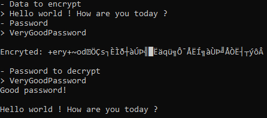
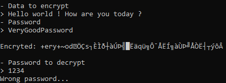

# Simplest-Encryption-Algorithm
A simple encryption algorithm which check whether the password is correct.

## Preview
Here is a small example. For the good password:

And for the wrong password:

## Contributions
You are free to contribute, you can create a new encryption algorithm and override the base class (Encryption).
